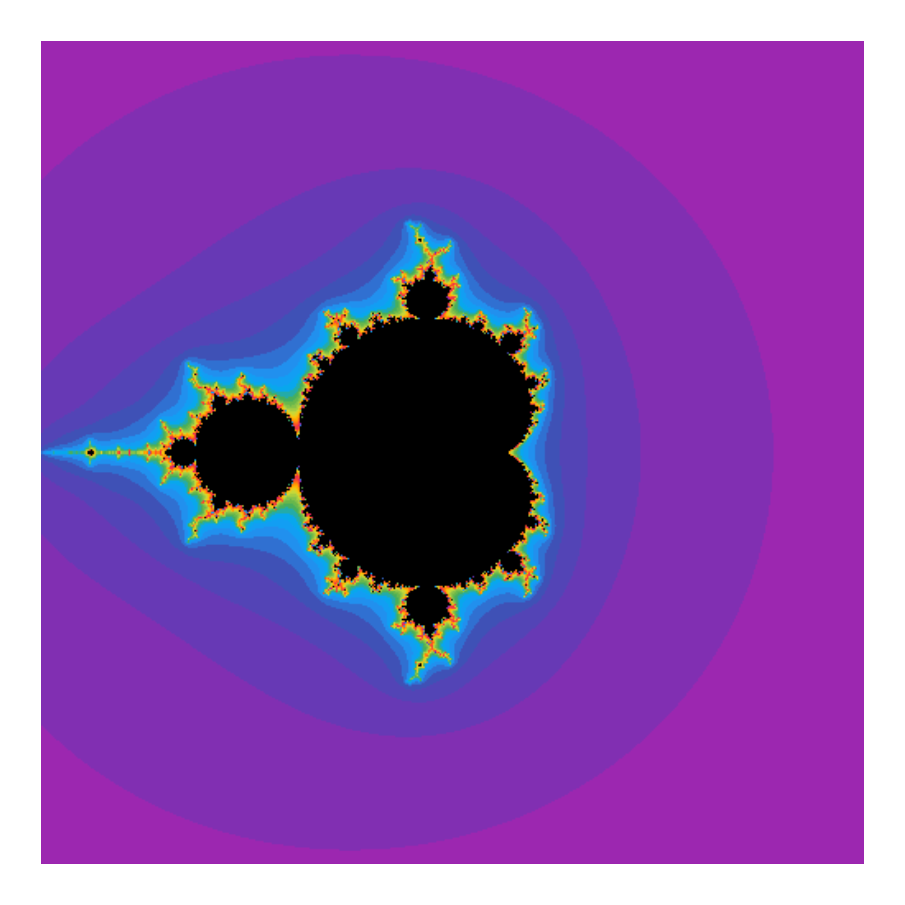

# Fractals

Fractal stuff.

## Using base R

**TO DO:**

-   [ ] Optimize

**HELP NEEDED:**

-   [ ] How to paralelize
-   [ ] How to animate

### Basic

``` r
library(ggplot2)
library(mandelbrot)

# Download function
source("https://raw.githubusercontent.com/DominiqueMakowski/fractals/main/mandelbrot.R")

data <- mandelbrot(resolution = 500, iterations = 50)

# Colors
cols <- see::palette_material(palette = "rainbow")(50)
cols <- mandelbrot::mandelbrot_palette(cols,
                                       fold = TRUE, 
                                       in_set = "black")

# Plot
ggplot(data, aes(x = x, y = y, fill = n)) +
  geom_raster(interpolate = TRUE) +
  theme_void() +
  scale_fill_gradientn(colours = cols, guide = "none")
```

<!-- -->
