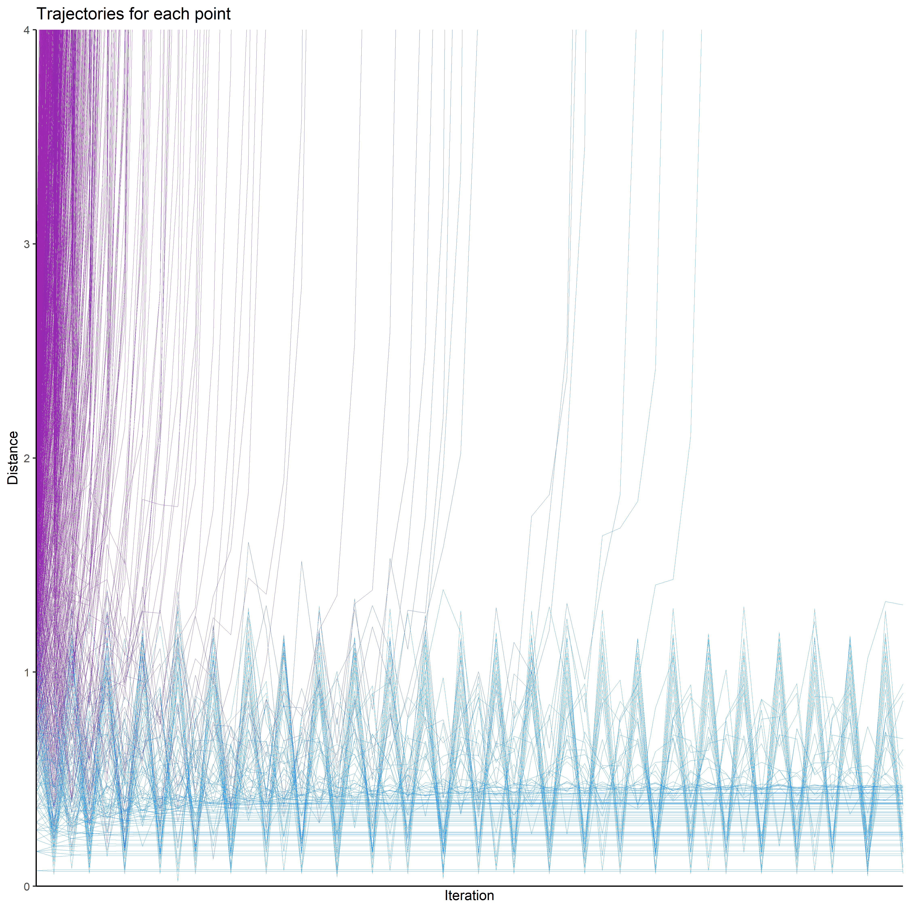

# Fractals

Fractal stuff.

## Using base R

**TO DO:**

-   [ ] Optimize

**HELP NEEDED:**

-   [ ] How to paralelize
-   [ ] How to animate

### Basic

``` r
library(tidyverse)
library(mandelbrot)

# Download `mandelbrot()` function
source("https://raw.githubusercontent.com/DominiqueMakowski/fractals/main/mandelbrot.R")

iterations <- 50
data <- mandelbrot(resolution = 500, iterations = iterations)

# Colors
cols <- see::palette_material(palette = "rainbow")(iterations)
cols <- mandelbrot::mandelbrot_palette(cols,
                                       fold = TRUE, 
                                       in_set = "black")

# Plot
ggplot(data, aes(x = x, y = y, fill = n)) +
  geom_raster(interpolate = TRUE) +
  theme_void() +
  scale_fill_gradientn(colours = cols, guide = "none")
```

<!-- -->

### Exploration

``` r
iter <- mandelbrot(resolution = 40, iterations = iterations) %>% 
  mutate(start = iter_1) %>% 
  bayestestR::reshape_iterations() %>% 
  filter(iter_value < 100) %>% 
  mutate(n = as.factor(n))

ggplot(iter, aes(x = iter_group, y = iter_value)) +
  geom_line(aes(group = iter_index, color = n), size = 0.05, alpha = 2/3) +
  coord_cartesian(ylim = c(0, 4)) +
  theme_classic() +
  scale_y_continuous(expand = c(0, 0)) +
  scale_x_discrete(expand = c(0, 0)) +
  scale_color_manual(values = cols, guide = "none") +
  labs(y = "Distance", x = "Iteration", title = "Trajectories for each point")
```

<!-- -->
